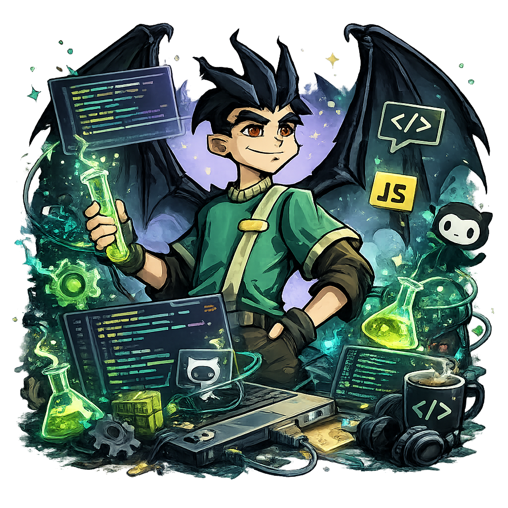

# <Hello>你好👋, &nbsp;I'm Binwen Wu</Hello>

- 🌱 I'm currently learning Scala and Continuous Integration(CircleCI)
- 👯 Undergraduate "supper" students certified by OGC experts
- 💬 Ask me about anything, I am happy to help
- ⚡️ Fun-Fact: I have a degree in Remote sensing science and technology

 

  
  
  
  

### 

<table>
<tr>
<td width="50%" align="center" valign="middle">

</td>
<td width="50%" valign="middle">

**Languages** &nbsp;
<code></code>
<code></code>
<code></code>
<code></code>
<code></code>
<code></code>
<code></code>

**Backend** &nbsp;
<code></code>
<code></code>
<code></code>
<code></code>
<code></code>
<code></code>
<code></code>

**LLM & AI** &nbsp;
<code></code>
<code></code>
<code></code>
<code></code>
<code></code>
<code></code>
<code></code>

**Databases** &nbsp;
<code></code>
<code></code>
<code></code>
<code></code>
<code></code>
<code></code>
<code></code>

**DevOps** &nbsp;
<code></code>
<code></code>
<code></code>
<code></code>
<code></code>
<code></code>
<code></code>

</td>
</tr>
</table>

### 

  
  

  

  

  

